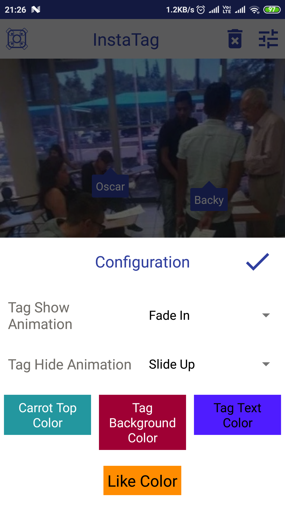

# InstaTag (Tag & Like Photos Like Instagram)


<br/>
### [Library in Action](https://youtu.be/-cPl9iPBIWE)

## Screenshots

<div id="images" style="#images {
    white-space: nowrap;
}">


</div>
<br/>

<div id="images" style="#images {
    white-space: nowrap;
}">



</div>
<br/>


### Overview of InstaTag
* We can add tags to a photo like Instagram.
* Tags can be dragged over photo to any position within photo bounds.
* Tags can be customized in following : Text Color, Top Carrot and Tag Background or Tag Color.
* Showing and Hiding of Tags can be animated with custom animation like (Slide Up/Down, Zoom In/Out, Bounce Up/Down etc.)
* Apart from Tags we can also use the Instagram like animation for liking photos.
* Like feature can be customized in following : Like Color and Like Size.
* Both Tags and Like can be customized at runtime or while declaring in layout files.
* A Sample implementation of the Library is included in [instatagsample module](https://github.com/harsh159357/InstaTag/tree/master/instatagsample)


## Using InstaTag Library in your Android application

Library Setup
* Import [instatag module](https://github.com/harsh159357/InstaTag/tree/master/instatag) in your project.
* Or Use [instatag module](https://github.com/harsh159357/InstaTag/tree/master/instatag) files as per your need by copy pasting.

After Downloading [instatag module](https://github.com/harsh159357/InstaTag/tree/master/instatag) [build.gradle](https://github.com/harsh159357/InstaTag/blob/master/instatagsample/build.gradle)
```groovy
    implementation project(':instatag')
```

### Using InstaTag While Tagging a Photo

In layout file of your activity or fragment use it like this [fragment_tag_photo.xml](https://github.com/harsh159357/InstaTag/blob/a1bcb27767705b473747397142a152482dcf02ba/instatagsample/src/main/res/layout/fragment_tag_photo.xml#L100)
```xml
        <com.harsh.instatag.InstaTag
            android:id="@+id/insta_tag"
            android:layout_width="match_parent"
            android:layout_height="wrap_content"
            app:canWeAddTags="true"
            app:instaTextColor="@android:color/white" />
```
Following things are customizable for InstaTag in Layout (Available Attributes) [attrs.xml](https://github.com/harsh159357/InstaTag/blob/master/instatag/src/main/res/values/attrs.xml)
```xml
        <attr name="canWeAddTags" format="boolean" />
        <!--Used for restricting tag movement when you are not tagging photos.
        (For example you are using InstaTag inside RecyclerView you have to provide false -->
        <attr name="overrideDefaultColor" format="color" />
        <!--Used to change Default Color being used for Tag Background & Tag Top Carrot-->
        <attr name="instaTextColor" format="color" />
        <!--Used for changing Tag text Color-->
        <attr name="instaBackgroundColor" format="color" />
        <!--Used for changing background color for Tag background-->
        <attr name="carrotTopColor" format="color" />
        <!--Used for changing Top Carrot color-->
        <attr name="tagTextBackground" format="reference" />
        <!--Used for changing tag background with custom background -->
        <attr name="carrotTopBackground" format="reference" />
        <!--Used for replacing top carrot background with custom background-->
        <attr name="hideAnimation" format="reference" />
        <!--Used for animating tag while hiding-->
        <attr name="showAnimation" format="reference" />
        <!--Used for animating tag while showing-->
        <attr name="likeColor" format="color" />
        <!--Used for setting like color-->
        <attr name="likeSize" format="dimension" />
        <!--Used for setting like size-->
        <attr name="likeSrc" format="reference" />
        <!--Used for setting source for like-->
```

While using InstaTag for Tagging Photos make sure to Implement [PhotoEvent Interface](https://github.com/harsh159357/InstaTag/blob/a1bcb27767705b473747397142a152482dcf02ba/instatag/src/main/java/com/harsh/instatag/InstaTag.java#L179) in your activity or fragment
<br/>& [TagPhotoFragment.java](https://github.com/harsh159357/InstaTag/blob/master/instatagsample/src/main/java/com/harsh/instatagsample/fragments/dashboard/TagPhotoFragment.java)
```java
//Referencing from Layout
InstaTag instaTag = rootView.findViewById(R.id.insta_tag);
//Setting listener for the image captured on the photo being tagged
instaTag.setTaggedPhotoEvent(photoEvent);

//Implemented PhotoEvent
    private final InstaTag.PhotoEvent photoEvent = new InstaTag.PhotoEvent() {

        /*
        Following method is called when you have tapped on anywhere inside the photo which you are tagging
        You will be returned with x and y coordinates of the point where you tapped
        make sure to save these coordinates temporarily as they will be used when you are done with choosing
        a user to be tagged in photo
        */
        @Override
        public void singleTapConfirmedAndRootIsInTouch(final int x, final int y) {
            getActivity().runOnUiThread(new Runnable() {
                @Override
                public void run() {

                    // Storing coordinates temporarily
                    addTagInX = x;
                    addTagInY = y;

                    // A List with Dummy users which can be tagged on photo
                    recyclerViewUsers.setVisibility(View.VISIBLE);
                    headerUsers.setVisibility(View.GONE);
                    tapPhotoToTagUser.setVisibility(View.GONE);
                    headerSearchUsers.setVisibility(View.VISIBLE);
                }
            });
        }

        @Override
        public boolean onDoubleTap(MotionEvent e) {
            return true;
        }

        @Override
        public boolean onDoubleTapEvent(MotionEvent e) {
            return true;
        }

        @Override
        public void onLongPress(MotionEvent e) {

        }
    };
```

After Initializing InstTag with PhotoEvent Listener and Capturing x & y coordinates of User of List
<br/> add tag in InstaTag as follows -
```java
    @Override
    public void onUserClick(final User user, int position) {
        getActivity().runOnUiThread(new Runnable() {
            @Override
            public void run() {
                KeyBoardUtil.hideKeyboard(getActivity());

                /*
                 Use addTag(x,y,uniqueId) method of InstaTag you can also see that we have
                 used temporarily saved coordinates in from PhotoEvent overridden method
                */
                instaTag.addTag(addTagInX, addTagInY, user.getUserName());

                recyclerViewUsers.setVisibility(View.GONE);
                tapPhotoToTagUser.setVisibility(View.VISIBLE);
                headerSearchUsers.setVisibility(View.GONE);
                headerUsers.setVisibility(View.VISIBLE);
            }
        });
    }
```

### :heart: Found this project useful?
If you found this project useful, then please consider giving it a :star: on Github and sharing it with your friends via social media.

### Last But not Least
There are still some things which are pending in this project make a pull request to improve this project or suggest an idea
to improve this project further by raising issues.

### Project Maintained By

# [Harsh Sharma](http://bit.ly/githarsh)

Android Developer

<a href="http://bit.ly/stackharsh"></a>
<a href="http://bit.ly/lnkdharsh"></a>
<a href="http://bit.ly/harshfb"></a>

License
-------

    Copyright 2019 Harsh Sharma

    Licensed under the Apache License, Version 2.0 (the "License");
    you may not use this file except in compliance with the License.
    You may obtain a copy of the License at

       http://www.apache.org/licenses/LICENSE-2.0

    Unless required by applicable law or agreed to in writing, software
    distributed under the License is distributed on an "AS IS" BASIS,
    WITHOUT WARRANTIES OR CONDITIONS OF ANY KIND, either express or implied.
    See the License for the specific language governing permissions and
    limitations under the License.
